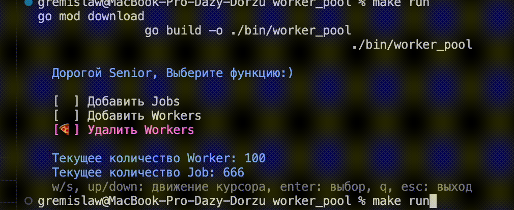

# worker_pool
## Тестовое задание в рамках vk internship.

- Worker-pool с возможностью динамически добавлять и удалять воркеры

## Cборка проекта

```bash
make build
```

## Запуск проекта

```bash
make run
```
В файле `/bin/out.txt` можно посмотреть действия программы

## Функционал

- `Добавить Jobs <count> <data>` - создаст новые <strong>job'ы</strong> с информацией <strong><_data_></strong> в количестве <strong><_count_></strong>
-  `Добавить Workers <count>` - cоздаст новых <strong>worker'ов</strong> в количестве <strong>count</strong>
-  `Удалить Workers <count>` - удалит <strong>worker'ов</strong> в количестве <strong>count</strong>

## Запуск unit-тестов

```bash
make test
```


## Пример

